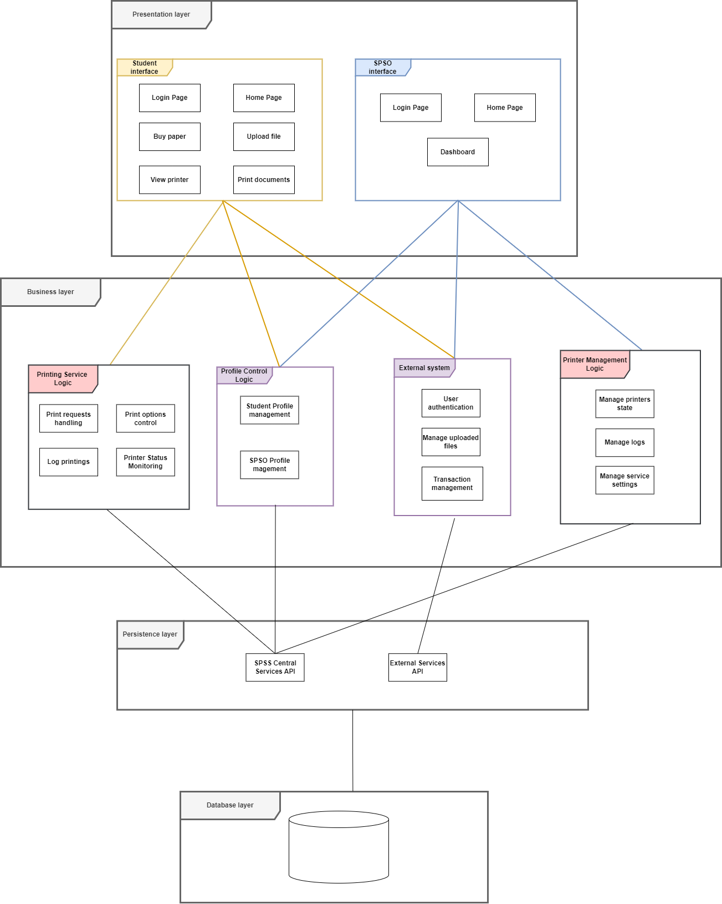
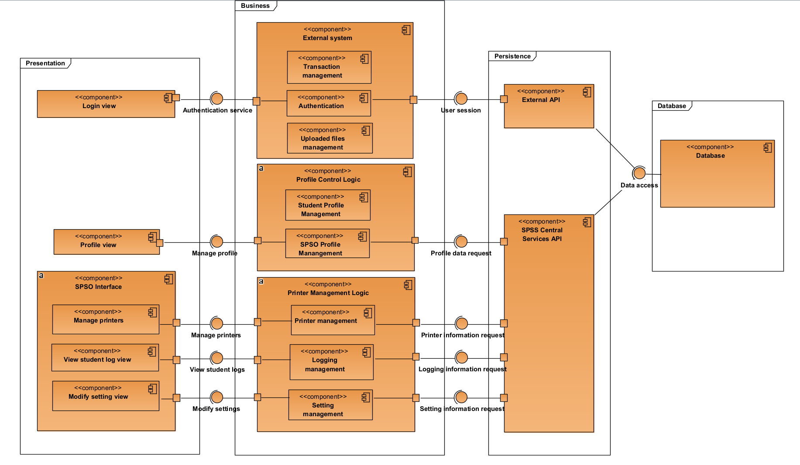

# Architecture Sesign

## Table of Contents
- [Architecture Sesign](#architecture-sesign)
  - [Table of Contents](#table-of-contents)
  - [Layered architecture](#layered-architecture)
    - [Presentation Strategy](#presentation-strategy)
    - [Data Storage Approach](#data-storage-approach)
    - [External services/API](#external-servicesapi)
    - [Components diagram](#components-diagram)

## Layered architecture

### Presentation Strategy
- The Presentation Layer is divided into two interfaces: Student Interface and SPSO Interface.
  - Both user types access the system through the pre-existing HCMUT Single Sign-On (SSO), ensuring secure authentication.
  
- Student Interface:
  - Upon logging in, students are directed to a personalized Home Page:
    - Displays current page balance.
    - Shows recent print activities.
    - Allows students to buy more paper.
  - Features:
    - **File Upload**: 
      - Push documents to the account’s document repository.
      - Detached from the Print Document feature to avoid redundant uploads.
    - **View Printer**: 
      - Provides information about printer locations and statuses on campus.
    - **Print Documents**: 
      - Allows students to select printers, ideally the nearest one.
      - Configure print options (e.g., paper size, single/double-sided, number of copies).
      - Monitor printing progress.

- SPSO Interface:
  - Upon logging in, SPSOs are directed to a Dashboard:
    - Provides an overview of system information:
      - Printer usage.
      - Monthly print job report of the SPSS.
    - Service Controls:
      - Add new printers from a list of unused printers.
      - Enable/Disable printers.
      - Define allowable file types for student uploads.
      - Manage various system configurations.

### Data Storage Approach
- Choice of MySQL for Data Management:
  - Reliable and efficient for structured data.
  
  - Scalable and beginner-friendly, making it a suitable choice for the system.

- Database Entities:
  - **Printers**: Configuration and status data.
  - **Logs**: Records of print jobs and activities.
  - **Student and SPSO Accounts**: Profile management.

- Issues in Handling Large Binary Files using MySQL:
  - MySQL is not suitable for storing large binary files (e.g., student-uploaded documents for printing).
  
  - Storing such files directly in MySQL can lead to performance issues and increased storage costs.

- External Storage Integration:
  - Integrated **Google Cloud Storage (GCS)** to manage large files efficiently.
  
  - Optimizes MySQL for core data like Printers, Logs, and User Accounts.
  
  - Handles uploading, storing, and retrieving document files.

- Documentation Scope:
  - Excludes details on Google Cloud Storage.

  - Concentrates on MySQL’s role and configuration within the system.

 

**1. Student Table:**

| Attribute    | Data Type    | Description                                            |
|--------------|--------------|--------------------------------------------------------|
| StudentID    | VARCHAR(10)  | Unique identifier for each student                     |
| First Name   | VARCHAR(20)  | The first name of the student                          |
| Last Name    | VARCHAR(50)  | The last name of the student                           |
| Email        | VARCHAR(100) | The email of the student                               |
| Faculty      | VARCHAR(50)  | The faculty of the student                             |
| PageBalance  | INT          | Remaining page balance for the student                 |
| Repository   | TEXT         | A link to the student’s document repository storage service |

 

**2. SPSO Table:**

| Attribute | Data Type   | Description                               |
|-----------|-------------|-------------------------------------------|
| SPSOID    | VARCHAR(10) | Unique identifier for each SPSO           |
| Name      | VARCHAR(50) | Name of the SPSO                          |
| Email     | VARCHAR(100)| The email of the SPSO                     |

 

**3. Printer Table:**

| Attribute | Data Type        | Description                                          |
|-----------|------------------|------------------------------------------------------|
| PrinterID | VARCHAR(20)      | Unique identifier for each printer                   |
| Location  | VARCHAR(10)      | Location (building) of the printer                   |
| Status    | ENUM(online, offline) | Current status of the printer                |
| Model     | VARCHAR(50)      | Model of the printer                                 |
| SPSOID    | VARCHAR(20)      | ID of the SPSO responsible for the printer           |

 

**4. Log Table:**

| Attribute   | Data Type   | Description                                                       |
|-------------|-------------|-------------------------------------------------------------------|
| LOGID       | INT         | Unique identifier for each printing log entry                     |
| StudentID   | VARCHAR(10) | Unique identifier for each student                                |
| SPSOID      | VARCHAR(10) | Unique identifier for each SPSO                                   |
| File        | VARCHAR(100)| Name of the file printed                                          |
| Page        | INT         | The number of pages used for this print job                       |
| Format      | TEXT        | A string representation of the print job settings                 |
| DateAndTime | DATETIME    | Date and time when the print job was executed                     |

### External services/API
- The API architecture is divided into two main categories within the Persistence Layer: 
  - Central Services API:
    - Manages core functionalities of the SPSS.
    - Responsibilities:
      - Printer configurations management.
      - Student profile management.
      - Print logs handling.
  
  - External Services API:
    - Facilitates integration with external systems such as BKPay and HCMUT_SSO.
    - Responsibilities:
      - Authentication and transaction management.
      - Document file uploads, metadata retrieval, and management.

- Purpose:
  - Ensures seamless communication between:
    - **Business Layer**: Handles the application logic.
    - **Database Layer**: Stores and retrieves data.
    - **External Systems**: Enables integration with pre-existing systems.

- Below are detailed API function tables for several key classes within the SPSS API module.

 

**1. Printer API:**

| Method      | Parameter | Description                                              |
|-------------|-----------|----------------------------------------------------------|
| enable      |           | Enables this printer, making it available for use.       |
| disable     |           | Disables this printer, marking it as unavailable.        |
| print       |           | Initiates a print job on this printer.                   |
| setSPSOID   |           | Assigns an SPSO to manage the specified printer.         |
| getSPSOID   |           | Retrieve the SPSOID responsible for this printer.       |
| setLocation |           | Set the printer’s location.                              |
| getLocation |           | Get the printer’s location.                              |
| setStatus   |           | Set the printer’s status.                                |
| getStatus   |           | Get the printer’s status.                                |
| setID       |           | Set the printer’s ID.                                    |
| getID       |           | Get the printer’s ID.                                    |
| setModel    |           | Set the printer’s model.                                 |
| getModel    |           | Get the printer’s model.                                 |

 

**2. SPSO API:**

| Method                | Passing Parameter | Description                                                                    |
|-----------------------|-------------------|--------------------------------------------------------------------------------|
| turnOnPrinter         | PrinterID         | Turn on the specified printer.                                                 |
| turnOffPrinter        | PrinterID         | Turn off the specified printer.                                                |
| addPrinter            | PrinterID         | Add a new printer to the system.                                               |
| viewLogSortedByStudent|                   | Retrieve printing logs sorted by alphabetical order of Student’s first name.   |
| viewLogSortedByPrinter|                   | Retrieve printing logs sorted by alphabetical order of Printer’s model (a.k.a name). |
| generateReport        |                   | Generate a report of printing activity.                                        |
| setID                 |                   | Set the SPSOID.                                                                |
| getID                 |                   | Get the SPSOID.                                                                |

 

**3. Student API:**

| Method               | Passing Parameter | Description                                                              |
|----------------------|-------------------|--------------------------------------------------------------------------|
| sendPrintRequest     | File, PrinterID   | Submits a print request for the student.                                 |
| viewInfo             | StudentID         | Fetches the student's profile and account balance.                       |
| manageInfo           | StudentID         | Updates the student's profile information.                               |
| viewLogSortedByStudent | StudentID       | Retrieve printing logs of a specific student, sorted by date.            |
| generateReport       | StudentID         | Generate a report of printing activity.                                  |
| uploadFile           |                   | Upload a document to an external service repository.                     |
| viewUploadedFiles    |                   | View the documents in the repository.                                    |
| getID                |                   | Get the student ID.                                                      |
| getName              |                   | Get the student full name.                                               |
| getEmail             |                   | Get the student email.                                                   |
| getFaculty           |                   | Get the student faculty.                                                 |

 

**4. SPSS API:**

| Method                    | Passing Parameter | Description                                                                        |
|---------------------------|-------------------|------------------------------------------------------------------------------------|
| returnAvailablePrinters   |                   | Fetches a list of all available printers and their statuses.                        |
| returnReports             |                   | Return a list of system usage reports for a given time frame.                       |
| returnLogSortedByStudent  |                   | Retrieves printing logs for a specified student.                                   |
| returnLogSortedByPrinters |                   | Retrieves printing logs sorted by a specific printer.                              |
| returnSPSOIDPrinters      |                   | Retrieves a list of printers managed by a specific SPSO.                            |
| setTimeToAllocatePaper    |                   | Sets the default time interval to allocate papers for printing to the students.    |
| setNumOfPapersToAllocate  |                   | Validates a print request based on page balance and printer availability.          |
| verifyPrintRequest        | File, PrinterID   | Updates the list of valid file extensions allowed for printing.                    |
| verifyBuyPaperRequest     |                   | Verifies the student's purchase request for additional printing pages.              |

- Purpose: Ensures smooth integration between HCMUT Student Smart Printing Service (HCMUT_SSPS) and external systems like Google Cloud Storage (GCS), HCMUT_SSO, and BKPay.

- Google Cloud Storage (GCS):
  - Provides each student a personal storage space linked to their school Gmail.

  - File Uploads:
    - Enables secure document uploads.
    
    - Filters and verifies files based on allowed extensions.
  
  - Metadata Retrieval:
    - Fetches and displays file names, sizes, and timestamps.
    
    - Displays information in the SPSS interface for document management.
  
  - Bucket Management: Manages document sorting and storage efficiently.

- HCMUT Single Sign-On (HCMUT_SSO):
  - Provides secure, centralized authentication for accessing the SPSS.

- BKPay Integration:
  - Facilitates payments for additional printing credits.
  
  - Supports necessary transaction and authentication functions.

- Although detailed documentation for HCMUT_SSO and BKPay is unavailable, standard API functionalities like authentication and transaction handling are assumed for seamless SPSS integration. 

### Components diagram

The component diagram illustrates the architecture of the SPSO View module, designed within a layered structure comprising the Presentation, Business, Persistence, and Database layers. In the Presentation layer, the SPSO Interface includes components for managing printers, viewing student logs, and modifying settings. The Manage Printers Component allows SPSO staff to oversee printer configurations, interacting with the Printer Management logic in the Business layer. The View Student Log View Component provides access to student printing activity logs through the Logging Management component, while the Modify Setting View Component enables staff to adjust system configurations via the Setting Management component. The Business layer contains the core logic for the module, including Printer Management Logic (with subcomponents for printer management, logging management, and setting management) and Profile Control Logic, which oversees SPSO Profile Management and Student Profile Management. These components depend on the SPSS Central Services API in the Persistence layer, which centralizes communication between the business logic and the Database layer. The Database layer serves as the central repository, managing data for printers, logs, student profiles, and system settings. This architecture supports seamless interactions, ensuring efficient printer management, logging, and system configuration for SPSO staff.